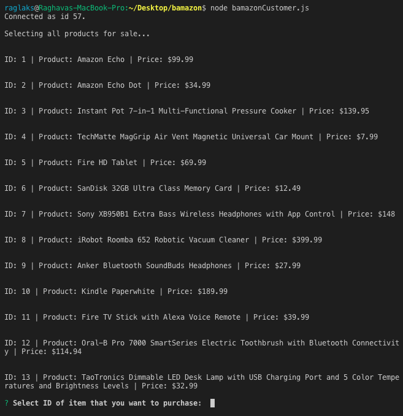
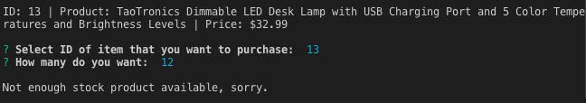
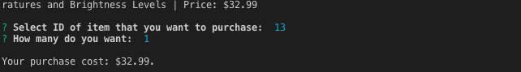
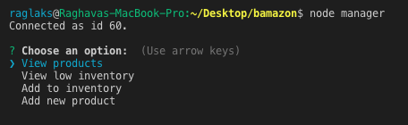
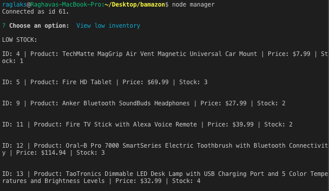
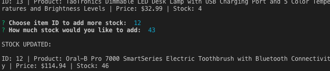
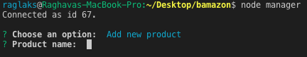
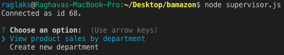
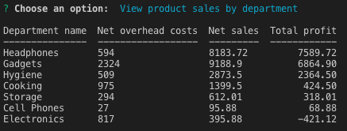

# Bamazon

This command line Node app is basically an Amazon clone. The back-end part consists of a database, built with MySQL, to store information about different products available for sale. The "front-end" part is divided into three sections: customer, manager and supervisor. The user may interact with any one of these sections and by doing so, the database will be updated dynamically. Here is a small walk-through of each different section:

## Bamazon for customers

Before you start, run `npm install` to get the required modules for this app. Then, type `node bamazonCustomer.js` and you will automatically be shown a list of available products:

Then, you will be prompted to choose an item index of an item that you would like to buy. It will also prompt you on the quantity of the item that you would like. If there isn't enough stock, the app won't let you purchase the item:

However, if there is enough stock of the product, you will see this message, which gives you the total amount of money that you spent:

The `products` database will then be updated to reflect these new values.

## Bamazon for managers

When you run `node manager`, you will be able to do the following:

"View products" will show the complete stock of all items in the `products` database, including stock quantities. "View low inventory" will check the `products` database and show all the products with an inventory of less than five: 

"Add to inventory" will show the complete stock of all items and then prompt you for an item ID that you would like to add to, along with the quantity. The end result will look like this:

Finally, "Add new product" will allow you to add a new item to the `products` database. You must include the stock quantity of the item:

Again, all of these changes and additions will be update `products` dynamically. Feel free to take a look at the schema files to see how the table was created and what kind of variables it holds.

## Bamazon for supervisors

When you run `node supervisor`, you will be prompted with the following options:

When you select "View product sales by department", a table will be printed to the console. This is more of a basic statistical approach because the information displayed goes through a series of SQL Joins and other calculations to visualize how each different department is doing numbers-wise. Essentially, you'll know which department is losing money and vice-versa.

The other option in the menu, "Create new department" will simply allow you to create and add a new department to the `departments` database. If you're interested, take a look at the departmentsSchema.sql file to see how the `departments` database is structured and how the `INNER JOIN` query for the profits table is built.

## Final thoughts

This was a very challenging build because of the whole data-storage and data-retrieval aspect. Although MySQL is fairly straighforward, I was completely lost when having to do more complex queries such as the profits table for supervisors. After a few days of extensive YouTube tutorials on SQL Joins, I finally managed to crack the problem and came up with this query:

`SELECT departments.department_name, SUM(departments.over_head_costs) AS net_costs, SUM(products.product_sales) AS net_sales, (SUM(products.product_sales) - SUM(departments.over_head_costs)) AS total_profit
FROM departments 
INNER JOIN products 
ON products.item_id = departments.department_id 
GROUP BY department_name 
ORDER BY total_profit DESC;`

But this solution only came to me by breaking down the task at hand and then building up from there. 

Here are two queries that proved essential for the final one:

`SELECT department_name, SUM(over_head_costs)
FROM departments
GROUP BY department_name
ORDER BY SUM(over_head_costs) DESC;`

`SELECT department_name, SUM(product_sales) 
FROM products
GROUP BY department_name
ORDER BY SUM(product_sales) DESC;`

These two building blocks helped me visualize what each SQL command was doing to the data, thus allowing me to progress.

I'm very proud of finishing this app because it feels like a culmination of daunting web-development skills that I've picked up fairly recently. I now realize that Node.js and SQL are very, very powerful tools that should be a part of any web developer's arsenal. I'm also fully aware that my app is far from ready for the real-world (mainly because of scary SQL-injection attacks), but this is still a good dip into deeper waters.
